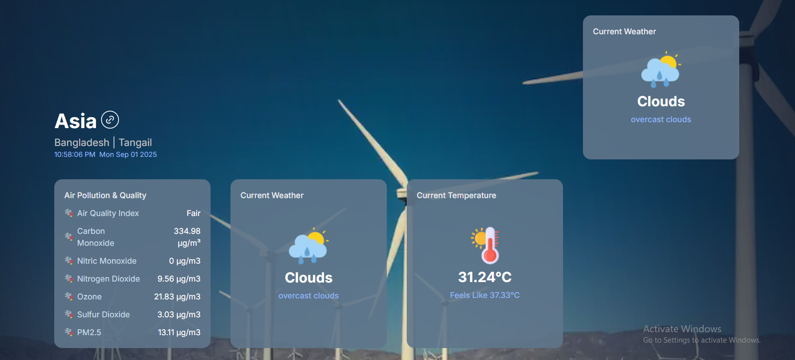
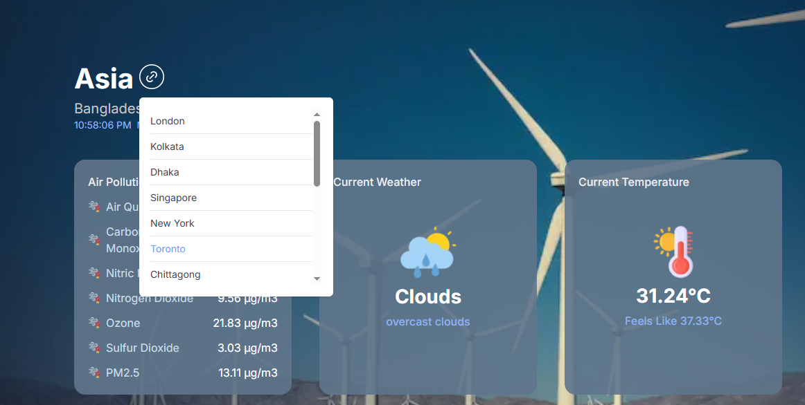
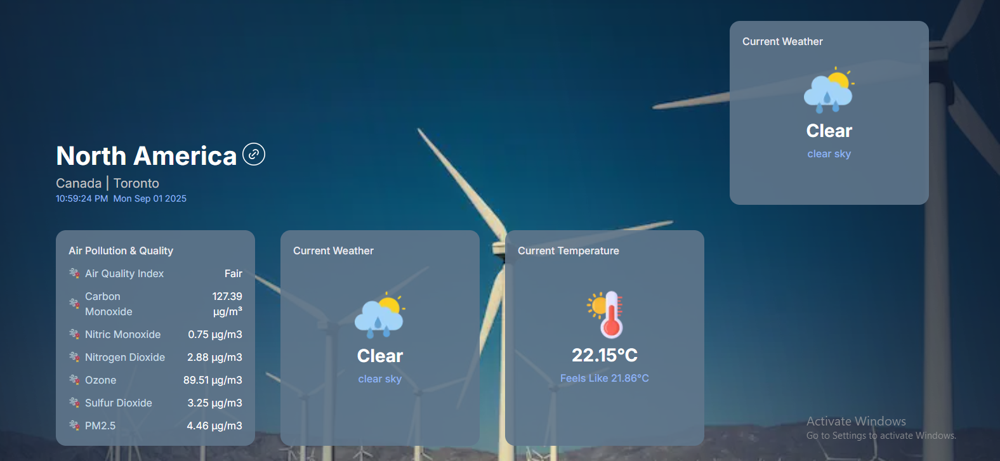
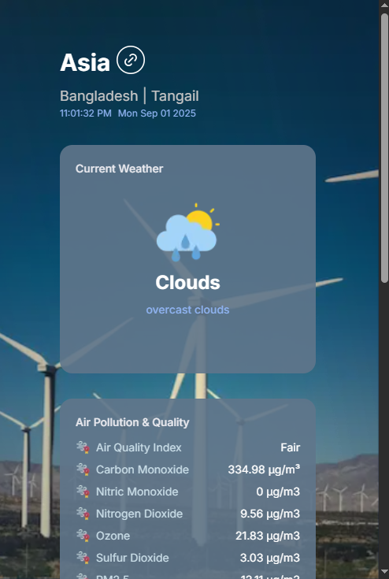
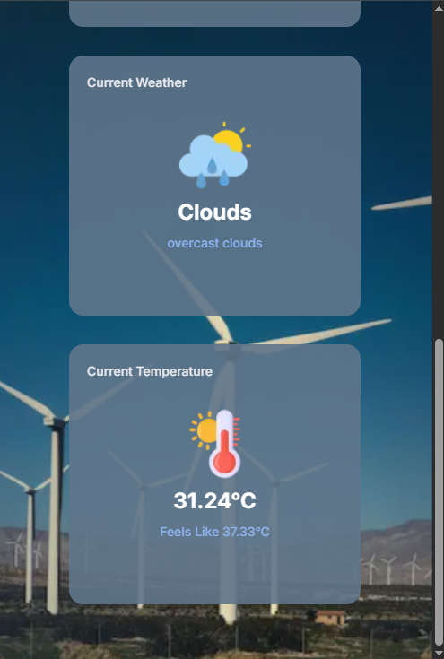

# Climate Pulse

Welcome to **Climate Pulse**, a Next.js-based web application that provides real-time weather and air quality information for various locations worldwide. This project utilizes dynamic routing, API routes, and a location switcher to deliver an interactive user experience.

## Overview

Climate Pulse displays current weather conditions, temperature, air quality index, and other environmental data for selected locations. The layout features a visually appealing design with a background image, a 2x2 grid of cards, and a location switcher (accessible via the link icon beside the region name). The project is built with Next.js, leveraging its App Router for dynamic routing and server-side rendering.

- **Region**: Displays the current region (e.g., North America) and city (e.g., New York City).
- **Cards**: Show details such as Current Weather (e.g., overcast clouds), Current Temperature (e.g., 23.59°C), and Air Pollution & Quality (e.g., Air Quality Index, pollutant levels).
- **Location Switcher**: Allows users to select from a list of locations to view data for different cities.

## Features

- **Dynamic Routing**: Navigate to specific location pages using Next.js dynamic routes.
- **API Routes**: Fetch and serve location-based data through custom API endpoints.
- **Location Switcher**: Interactive list to switch between locations, integrated with the UI.
- **Real-Time Data**: Displays current weather and air quality metrics (mocked or from an API).
- **Responsive Design**: Optimized layout with a background image and card-based information display.

## Prerequisites

- Node.js (v14.x or later)
- npm or yarn
- Git (for cloning the repository)

## Installation

1. Clone the repository:

   ```bash
   git clone https://github.com/khadija-T/climate-pulse.git
   cd climate-pulse
   ```

2. Run the server:

```bash
npm run dev
#or
yarn dev
```

Open http://localhost:3000 in your browser to see the app.

## Environment variable

- NEXT_PUBLIC_API_URL= get an api key from the [OpenWeather API](https://openweathermap.org/current)

## Screenshots

- 

- 

- 

- 

- 

## Contributing

Contributions are welcome! Please fork the repository and submit pull requests for any enhancements or bug fixes. Ensure to follow the existing code style and add tests if applicable.

## Contact

- **GitHub**: [khadija-T](https://github.com/khadija-T)
- **Email**: [khadija.t20037@gmail.com](mailto:khadija.t20037@gmail.com)
- **LinkedIn**: [Khadijatull Kobra](https://www.linkedin.com/in/khadijatull-kobra-80b1a9348)
